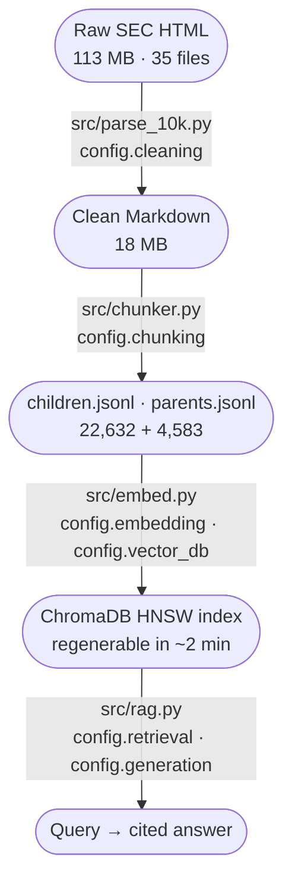
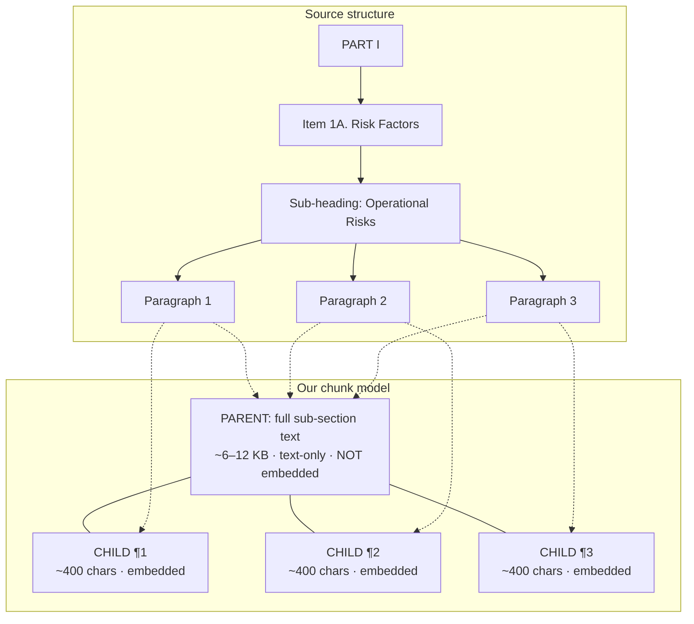

# 10k-rag

A hierarchical retrieval-augmented question-answering system over 35 SEC 10-K filings: Microsoft, Apple, Alphabet, Amazon, Meta, Nvidia, and Tesla, five fiscal years each (FY2021 through FY2025). Source on [GitHub](https://github.com/shiva-reddy/10k-rag).

The system answers natural-language questions across companies and across time, with answers grounded only in the filings. Every claim points to a specific Item, sub-heading, and EDGAR URL.

---

## 1. What it does

### What an SEC 10-K is

A 10-K is the annual report every US-listed public company is required to file with the Securities and Exchange Commission. A typical filing is 150 to 500 pages of structured narrative, audited financial tables, and footnoted accounting policy disclosures. It is the primary, legally binding source of what a company tells its public investors.

Its structure is fixed by Regulation S-K and divided into four Parts.

**Part I (the business and its risks)**
1. Item 1. Business
2. Item 1A. Risk Factors
3. Item 1B. Unresolved Staff Comments
4. Item 1C. Cybersecurity
5. Item 2. Properties
6. Item 3. Legal Proceedings
7. Item 4. Mine Safety Disclosures

**Part II (financial performance)**
1. Item 5. Market for Registrant's Common Equity
2. Item 6. [Reserved]
3. Item 7. Management's Discussion and Analysis (MD&A)
4. Item 7A. Quantitative and Qualitative Disclosures About Market Risk
5. Item 8. Financial Statements and Supplementary Data
6. Item 9 / 9A / 9B / 9C. Accountant changes, controls and procedures, other information, foreign-jurisdiction disclosures

**Part III (governance)** and **Part IV (exhibits)** cover director and officer information, executive compensation, security ownership, principal accountant fees, and the exhibit index. They are typically incorporated by reference from the company's proxy statement (DEF 14A) rather than written out in the 10-K itself.

The narrative items (1, 1A, 7, 7A) are the most analytically useful. They capture *how* a company describes its competitive position, risks, segment performance, and regulatory exposure in its own words. Risk Factors (1A) and MD&A (7) often run 50 to 150 pages each.

### What's in this corpus

35 filings: 7 companies × 5 fiscal years.

- **Companies**: Microsoft, Apple, Alphabet, Amazon, Meta, Nvidia, Tesla. The so-called "MAG7" tech megacaps.
- **Fiscal years**: FY2021 through FY2025. The five-year window spans the entire current-AI era and includes the SEC's late-2023 cybersecurity-disclosure rule (Item 1C).
- **Volume**: 113 MB raw HTML cleaned down to 18 MB Markdown after stripping XBRL tags, navigation chrome, and layout-only tables. Roughly 10.8 M characters and 2.2 M words of analyzable text.
- **Source**: every filing pulled directly from EDGAR (`data.sec.gov`) by accession number. The canonical filing URL is preserved as metadata on every chunk.

### Why these seven companies

Cross-company comparison is more compelling than single-company longitudinal. "How do Apple and Microsoft frame iPhone vs. Surface revenue concentration" is a richer question than "what did Microsoft say in 2022 vs. 2023." The MAG7 give:

- Same industry (tech megacaps), so accounting-comparable disclosures.
- All US-domiciled, so 10-K not 20-F. Same regulatory skeleton.
- Five years (FY2021 through FY2025) covers the entire current-AI era including the SEC's late-2023 cybersecurity disclosure rule (Item 1C, present only from FY2024).
- 35 filings is large enough to stress test (10.8 M characters, 22 K children) and small enough to iterate on (about two minutes for a full re-embed).

### What the system does

Given a natural-language question, the system retrieves the most relevant excerpts from the 35 filings and asks an LLM to answer using only those excerpts. Every claim in the answer ties back to its specific source: company, fiscal year, Item, sub-heading, and a click-through link to the filing on `sec.gov`.

### A real query, end-to-end

> **Q:** *"How does Microsoft frame AI risk in its risk factors?"*

The retriever scans all 35 filings and surfaces the three closest matches by cosine similarity (range 0 to 1).

| Rank | Source | Sub-heading | sim |
|---|---|---|---|
| 1 | MSFT FY2025, Item 1A | Other digital safety abuses | 0.646 |
| 2 | MSFT FY2022, Item 1A | Other digital safety abuses | 0.644 |
| 3 | MSFT FY2025, Item 1A | Other digital safety abuses | 0.634 |

Three Microsoft sub-sections across two fiscal years, all from Risk Factors, all from the same labeled sub-section. That is what the question asked for, and the system returned it without the caller having to specify a metadata filter. [Section 4 (Embed)](#4-embed) explains how the index becomes entity-aware so that an unfiltered query about Microsoft returns Microsoft material by default.

The LLM answer (Claude Haiku 4.5, temperature 0):

> Microsoft frames AI risk as a multi-dimensional threat to adoption, reputation, and legal/regulatory standing, and the framing has expanded materially from FY2022 through FY2025. Core categories that appear consistently include technical flaws ("AI algorithms or training methodologies may be flawed. Datasets may be overbroad, insufficient, or contain biased information" — **MSFT FY2023, FY2024, FY2025 Item 1A**), harmful or unintended outputs, and customer misuse of AI products. The FY2025 disclosure adds agentic-AI considerations, intellectual-property and training-data exposure, and a fragmenting global regulatory landscape including the EU AI Act (**MSFT FY2025 Item 1A**, "Other digital safety abuses"). FY2022 focused primarily on reputational and bias-related harms (**MSFT FY2022 Item 1A**).

This kind of cross-year, single-entity longitudinal comparison is what the corpus enables and what direct-LLM querying cannot reliably produce. The model has no access to FY2025-specific filing language until it is given those Items.

---

The pipeline that produces this answer has four stages. Each stage is a single Python module with a clean input-output contract, so any stage can be re-run in isolation as long as the previous stage's output is on disk.



[Sections 2 through 5](#2-parse) walk through the stages in order. [Section 6](#6-tuning) evaluates the parameter choices. [Section 9](#9-configuration-reference) collects every tunable knob in one reference table.

---

## 2. Parse

[`src/parse_10k.py`](https://github.com/shiva-reddy/10k-rag/blob/main/src/parse_10k.py) — raw SEC HTML in, clean Markdown out.

The parser walks the HTML DOM, drops XBRL inline tags (`ix:nonfraction` and friends), strips navigation chrome and hidden elements, and emits a typed token stream of headings, paragraphs, and tables. It then detects which token positions correspond to *content* occurrences of each SEC Item — filtering out the table-of-contents duplicates via a [largest-gap heuristic in `_detect_content_items`](https://github.com/shiva-reddy/10k-rag/blob/main/src/parse_10k.py) — drops the boilerplate Items per the cleaning config, and writes the surviving structure as Markdown with a strict shape (Items as `## Item N. Title`, sub-headings as `### Slug`, tables as pipe-tables with captions). Two side files travel with the Markdown: a metadata JSON with the EDGAR URL and accession number, and a lineage JSON tracking char and line offsets for every emitted element.

<details markdown="1">
<summary><strong>Why parser and chunker are separate</strong></summary>

`parse_10k.py` produces a Markdown file. `chunker.py` consumes a Markdown file. They never touch the same data structure in memory.

The chunker is decoupled from the source *format* (HTML, PDF) but still specialized for the 10-K *shape* (Items, sub-headings, financial tables). A new filer template, or a PDF re-distribution of the same filing, only changes the parser. The chunker stays specialized for 10-K structure regardless of how the Markdown was produced.

What this seam buys in practice:

- **Iteration speed.** Tuning chunking does not re-parse 35 HTML files across 7 filer templates. Re-chunking the cleaned Markdown takes seconds.
- **Debuggability.** The intermediate Markdown is human-readable and committed at `data/cleaned/`. You can read `MSFT-FY2024.md` and verify the parser made sensible decisions before any chunking runs.
- **Testability.** Chunker tests use synthetic Markdown strings, no HTML fixtures.
- **Pluggability.** A new filing format (10-Q, 20-F, non-SEC PDF earnings report) only needs a new parser that emits the same Markdown shape. The chunker, embedder, and retriever stay as-is.

</details>

<details markdown="1">
<summary><strong>Sub-heading and table detection without filer-specific code</strong></summary>

Each MAG7 filer uses a different SEC HTML template. There are no `<h2>` tags in most of these files; sub-headings are encoded by visual styling. The parser handles this with two universal rules.

**Bold-isolated detection** ([`_is_bold_isolated`](https://github.com/shiva-reddy/10k-rag/blob/main/src/parse_10k.py)). An inline element with CSS `font-weight` ≥ 600 (the universal CSS pattern, not just `<b>` / `<strong>`), short (≤ 100 chars), the sole content of its parent block, and followed by at least one non-bold paragraph, is promoted to a sub-heading. This catches every filer's stylistic conventions without enumerating them.

**Table classification** ([`_classify_table`](https://github.com/shiva-reddy/10k-rag/blob/main/src/parse_10k.py)). Every `<table>` is examined; the rule, simplified:

```python
def _classify_table(table):
    # Item-N tables are layout wrappers around section headings
    if first_text_matches(ITEM_REGEX or PART_REGEX): return "layout"
    # Tiny tables are chrome (signature blocks, page footers)
    if rows < 2 or cols < 2 or text_chars < 80: return "skip"
    # Sparse tables (low digit ratio) are layout, not data
    if digit_ratio < 0.015: return "layout"
    return "data"
```

Layout tables are unwrapped: their cells become flowing divs, so the headings encoded inside them are detectable as ordinary tokens. Data tables are emitted as Markdown pipe-tables with column pruning. The classifier is the single piece of code that lets one parser handle Microsoft's semantic `<p>` markup and Amazon's heading-in-table layout identically.

</details>

---

## 3. Chunk

[`src/chunker.py`](https://github.com/shiva-reddy/10k-rag/blob/main/src/chunker.py) — clean Markdown in, two JSONL files out: `children.jsonl` and `parents.jsonl`. Each child has exactly one `parent_id`.

### The chunking problem

The first instinct for retrieval over a long document is to slice it into fixed-size character windows and embed each one. The trouble is that those windows split mid-sentence and lose section context. A 400-character window may match a paragraph mentioning AI risk, but it loses which Item or sub-heading the paragraph came from, so the LLM has no way to cite it.

Going the other direction, treating each Item as one chunk, produces the opposite problem. Item 1A in META's FY2023 filing runs roughly 80 KB, which is large enough that the embedding averages over too much information to be useful as a retrieval target, and large enough that dropping the whole Item into the LLM context wastes most of that context on text unrelated to the question.

A third alternative is to use an LLM to chunk the document semantically. That approach is expensive on a 10 MB corpus, non-deterministic across runs, and adds a dependency we don't need given that the SEC has already imposed structure on the document.

### The 2-level hierarchical pattern

The pipeline keeps two granularities and a single hop between them.



- **Children** are paragraph-sized prose chunks or single tables. They are small, embedded into the vector index, and used for retrieval.
- **Parents** are full sub-sections, or full Items when no sub-headings exist. They are typically 6 to 12 KB of text, stored as JSONL on disk and loaded into memory by the retriever at query time, and they are never embedded.

At retrieval ([Section 5](#5-retrieve)) the system pulls the top-k matching children, looks up each child's parent via `parent_id`, dedupes, and feeds the parent text into the LLM context rather than the matched paragraphs alone.

### Why two levels

A 10-K is already structured as Item → sub-section → paragraph, and the 2-level pattern mirrors that structure rather than imposing one of its own. Each child carries exactly one `parent_id`, so the hop is an O(1) dictionary lookup with no recursion or merge logic.

The pattern does not fit every corpus. Chat logs and support tickets are flat enough that they don't have a parent worth retrieving, and sentence-window context is simpler in those cases. Synthesis-heavy queries like "summarize Microsoft's risk disclosures across five years" want many parents fed in at once, and the LLM context budget fills up before the hop helps. Relational queries like "how does Apple's supply-chain risk compare to TSMC's geographic concentration" want entity links rather than chunks. For 10-K question answering on the MAG7 corpus, the 2-level pattern matches both the structure of the documents and the shape of the queries we care about.

---

## 4. Embed

[`src/embed.py`](https://github.com/shiva-reddy/10k-rag/blob/main/src/embed.py) — `children.jsonl` in, ChromaDB persistent collection out at `data/chroma/`.

The embedder is `sentence-transformers/all-MiniLM-L6-v2`, a free local model that produces 384-dimensional vectors normalized for cosine similarity. ChromaDB wraps those vectors in an HNSW index. Parents are not embedded; they remain as JSONL on disk and are loaded into memory by the retriever at query time, so the "embed children only" rule is enforced at the storage boundary rather than by convention. There is no parent vector to query.

### What the embedder sees vs what the LLM sees

Every child chunk carries two text fields. The `text` field is the verbatim chunk content, which is what the LLM sees in its prompt and what each citation in the answer ultimately refers to. The `embedding_text` field is what the embedder turns into a vector, and it does not have to match `text`.

Tables have used this split since the first version of the chunker. A table's `text` is the full Markdown pipe-table including every cell, but its `embedding_text` is the caption together with the column headers and row labels (the strategy is controlled by `table_embedding_text`). The numbers in the cells are noise to a sentence transformer, while the labels carry whatever matchable semantic signal a financial table has.

### Metadata-augmented embeddings

[Section 1](#1-what-it-does) mentioned that an unfiltered query about Microsoft's AI risk used to surface a Meta paragraph at top-1, and that the same query now returns three Microsoft sub-sections instead. The reason is that the embedding model only sees text, and if the only text we embed is the chunk content, the word "Microsoft" rarely appears in it. Microsoft refers to itself as "we" throughout its own filing, so a Microsoft Risk Factors paragraph and a Meta Risk Factors paragraph on the same topic look nearly identical in the embedding space because topic similarity dominates over entity identity. The chunk metadata (`ticker`, `company`, `fy_label`, `item`, `sub_heading`) is stored alongside each vector but does not influence the vector itself, and it is queryable only through explicit `where` filters at query time.

The fix is to prepend that metadata to `embedding_text` so the index becomes entity-aware. The construction lives in [`_embedding_prefix`](https://github.com/shiva-reddy/10k-rag/blob/main/src/chunker.py):

```
embedding_text = "Microsoft Corporation (MSFT) | FY2025 | Item 1A | Other digital safety abuses\n\n" + chunk_text
```

The `text` field is unchanged, so the LLM sees exactly the chunk content as before, and only the embedder sees the prefix. "Microsoft" now appears as a token in every Microsoft chunk's embedding source, "Tesla" in every Tesla chunk's, and so on, and a query containing the word "Microsoft" pulls toward MSFT vectors via ordinary cosine similarity. On the demo query at the top of this page, top-1 similarity moved from 0.538 to 0.646 and the cross-entity bleed disappeared.

Hard scoping via `where={"ticker": "MSFT"}` is still available for callers that want explicit control, for example a UI that lets the user pick a company first, but the default behavior on unfiltered queries now matches what most callers actually want.

---

## 5. Retrieve

[`src/rag.py`](https://github.com/shiva-reddy/10k-rag/blob/main/src/rag.py) — query string in, cited natural-language answer out.

```
query → embed → top-k children → unique parents (one hop) → prompt → LLM → cited answer
```

The retriever embeds the query using the same model and normalization as the index, runs ChromaDB's `query` to get the top-k children with similarity scores, and then performs the single hop in [`expand_parents`](https://github.com/shiva-reddy/10k-rag/blob/main/src/rag.py). Each child carries a `parent_id`; the retriever looks up each parent in the in-memory parents dict, dedupes, and orders parents by their best-matching child's similarity. The LLM is then sent the full text of those parents (not the matched paragraphs alone), the original question, and an instruction template that constrains it to answer only from the provided excerpts and to cite each claim inline.

The LLM is invoked through the Anthropic SDK using the `ANTHROPIC_API_KEY` environment variable, with `claude-haiku-4-5` as the default model. The retriever can also run in retrieval-only mode without any LLM call, which is what the parameter comparisons in [Section 6](#6-tuning) use to evaluate retrieval quality without paying generation cost.

<details markdown="1">
<summary><strong>The instruction template sent to the LLM</strong></summary>

The retriever sends two messages to the model: an instruction template (passed as the API's `system` field) and a user message containing the question and the parent excerpts. The instruction template is what makes refusals on out-of-scope queries ([Section 8](#8-sample-queries)) graceful rather than hallucinated:

```text
You are a financial analyst answering questions about Microsoft (MSFT),
Apple (AAPL), Alphabet (GOOGL), Amazon (AMZN), Meta (META), Nvidia (NVDA),
and Tesla (TSLA) based ONLY on excerpts from their SEC 10-K filings (FY2021
through FY2025) provided to you in the user message.

Rules:
1. Use ONLY the provided excerpts. Do NOT draw on prior knowledge of these
   companies, their products, or events not described in the excerpts.
2. If the excerpts do not contain enough information to answer, say so
   plainly: "The provided 10-K excerpts do not address this."
3. Cite every factual claim inline using the company-fiscal-year-Item form
   shown next to each excerpt below, e.g., (MSFT FY2024 Item 1A).
4. When comparing companies or years, quote or paraphrase from each
   relevant excerpt and cite each one separately.
5. Be concise. Match length to the question; don't pad.
```

The user message wraps each retrieved parent with a `--- SOURCE i: (TICKER FY Item, "Sub-heading") ---` header so citations have explicit anchors. Source: [`build_prompt`](https://github.com/shiva-reddy/10k-rag/blob/main/src/rag.py).

</details>

### Citation lineage

Every retrieved chunk carries three layers of provenance, each useful in a different setting.

The first is the **logical breadcrumb**, a human-readable handle like `(MSFT FY2024 Item 1A, "Operational Risks")` that the LLM surfaces inline in its answer so the reader knows which company, fiscal year, and Item the claim came from.

The second is the **direct EDGAR URL**, a link to the canonical SEC filing on `sec.gov` for click-through verification by anyone who wants to read the original document.

The third is a **position-precise pointer**, recorded in metadata as `source_md=MSFT-FY2024.md`, `char_start=24531`, `char_end=25102`. This maps the chunk to a specific character range in the cleaned Markdown that is committed in the repo, so a citation can be verified character-for-character against the same text the system saw at retrieval time. The lineage JSON written by the parser preserves these char and line offsets for every paragraph and table.

---

## 6. Tuning

Each parameter that could plausibly affect retrieval quality was varied across two or three settings while every other knob was held at its default value. The same five eval queries were run against each setting, and the top-3 retrievals were captured. Script: [`scripts/run_all_sweeps.py`](https://github.com/shiva-reddy/10k-rag/blob/main/scripts/run_all_sweeps.py). Full output: [`data/sweeps/results.json`](https://github.com/shiva-reddy/10k-rag/blob/main/data/sweeps/results.json).

The five eval queries:

1. *"How does Microsoft frame AI risk in its risk factors?"* (MSFT)
2. *"Apple's iPhone revenue in fiscal 2024"* (AAPL)
3. *"Tesla's key-person succession risk"* (TSLA)
4. *"Google Cloud segment performance"* (GOOGL)
5. *"Cybersecurity governance disclosures across MAG7"* (cross-company)

The reported metric is top-1 cosine similarity together with whether the top-3 contain the expected entity. Top-1 similarity is a proxy for retrieval quality, not a direct measure of answer quality; an LLM-judge evaluation is the right follow-up.

### `embed_metadata_prefix` — the entity-aware index

This flag controls whether the embedder's input is prefixed with company, fiscal year, Item, and sub-heading metadata ([Section 4](#4-embed)). The prefix is a measured trade-off rather than a uniform win. On Q1, where Microsoft's filings refer to the company as "we" and Meta's risk-factors language is topically similar, the prefix is what lets the embedder tell the entities apart, flipping the top result from META to MSFT. On the other queries, where entity is unambiguous from the query alone, the prefix slightly lowers top-1 similarity by 0.02 to 0.07 because the metadata tokens dilute the content signal, but entity correctness in the top-3 is unaffected. Net positive: it fixes the failure case at a small cost to the unambiguous cases.

<details markdown="1">
<summary>Data</summary>

| Query | `true` (default) | `false` | Entity correctness |
|---|---|---|---|
| Q1 MSFT AI risk | **0.646 MSFT** (3/3) | 0.539 **META** (2/3) | flipped from wrong entity |
| Q2 AAPL iPhone | 0.732 AAPL (3/3) | 0.738 AAPL (3/3) | tie |
| Q3 TSLA key person | 0.524 TSLA (3/3) | 0.547 TSLA (3/3) | tie |
| Q4 GOOGL Cloud | 0.557 GOOGL (3/3) | 0.629 GOOGL (3/3) | tie |
| Q5 cyber MAG7 | 0.571 META | 0.596 GOOGL | n/a |

</details>

### `child_max_chars` — chunk size ceiling

Paragraphs longer than this are split at sentence boundaries. Smaller chunks (max=600) produce 6,500 more children and lift Q1 top-1 similarity by 0.05; the other four queries are unchanged and entity correctness stays 3/3 across every setting. The signal is real but mild. The default at 1200 is fine, and 600 is a candidate worth re-testing with an answer-quality evaluation rather than a similarity proxy.

<details markdown="1">
<summary>Data</summary>

| Setting | Children | Q1 | Q2 | Q3 | Q4 | Q5 |
|---|---|---|---|---|---|---|
| 600 | **29,290** | **0.698** MSFT | 0.732 AAPL | 0.530 TSLA | 0.557 GOOGL | 0.568 META |
| 1200 (default) | 22,632 | 0.646 MSFT | 0.732 AAPL | 0.524 TSLA | 0.557 GOOGL | 0.571 META |
| 2400 | 21,329 | 0.646 MSFT | 0.732 AAPL | 0.524 TSLA | 0.557 GOOGL | 0.561 META |

</details>

### `table_embedding_text` — what tables get embedded

What text is fed to the embedder for table chunks: caption alone, caption plus column headers and row labels, or full table cell content. With queries restricted to `chunk_type = "table"`, `caption_first_row_first_col` (the default) wins decisively on Q4, returning the correct entity at the highest similarity. `caption_only` ties on Q2 at marginally higher similarity but mis-attributes Q4 to the wrong entity. `full_text` underperforms across all queries because cell numbers dilute the matchable signal.

<details markdown="1">
<summary>Data</summary>

| Query | `caption_only` | `caption_first_row_first_col` (default) | `full_text` |
|---|---|---|---|
| Q2 iPhone revenue | 0.718 AAPL | 0.708 AAPL | 0.630 AAPL |
| Q4 Google Cloud | 0.456 **MSFT (wrong)** | **0.525 GOOGL** | 0.427 GOOGL |
| Q5 cyber MAG7 | 0.406 MSFT | 0.376 META | 0.386 AMZN |

</details>

---

## 7. Generalization

The parser and chunker were designed and debugged on the MAG7 corpus, but they have no filer-specific code. To check whether the same pipeline runs cleanly on filings outside that set, three companies that differ structurally from MAG7 were selected and the parse and chunk stages were run on the most recent 10-K for each:

- **BRK.A** — Berkshire Hathaway. Conglomerate, table-heavy, multi-segment.
- **JPM** — JPMorgan Chase. Bank. Industry-specific Item 7A (market risk).
- **DDOG** — Datadog. Tech mid-cap baseline.

Runner: [`scripts/test_generalization.py`](https://github.com/shiva-reddy/10k-rag/blob/main/scripts/test_generalization.py). Results: [`data/generalization/results.json`](https://github.com/shiva-reddy/10k-rag/blob/main/data/generalization/results.json).

| Filer | Items detected | Sub-headings | Tables kept | Tables in HTML (data / layout / skip) |
|---|---|---|---|---|
| **BRKA** | 10 | 71 | 103 | 118 / 2 / 0 |
| **JPM** | 10 | 32 | 4 | 298 / 380 / 1 |
| **DDOG** | 10 | 163 | 56 | 68 / 2 / 3 |

BRKA and DDOG parsed cleanly. Item structure was detected, sub-headings were found via the bold-isolated rule, and tables were classified into data and layout without any per-filer adjustments. DDOG's 163 sub-headings (the highest of the three) reflect Datadog's heavily structured product disclosures.

JPM is the interesting case. It kept only 4 tables despite the HTML containing 298 data-classified tables. Inspection of the cleaned Markdown shows why: JPM's Form 10-K is a wrapper, with Items 7, 7A, and 8 incorporating by reference to a separately-filed Annual Report. The actual body of those Items reads:

> *"Management's discussion and analysis of financial condition and results of operations… appears on pages 46–160. Such information should be read in conjunction with the Consolidated Financial Statements and Notes thereto, which appear on pages 165–314."*

So 4 tables kept is the correct output. The JPM 10-K cover document genuinely contains very few tables, and the financial statements live in the referenced Annual Report. The classifier itself functions normally on JPM, identifying 298 data tables and 380 layout tables in the raw HTML; the pipeline simply has no follow-document fetch step.

The takeaway is that the pipeline produces clean structured chunks from any standalone 10-K filed in modern HTML. Wrapper filings, where the financial statements live in an incorporated-by-reference document, need an additional fetch step for that referenced document. That extension is a parser-level change, not a chunker change.

---

## 8. Sample queries

The five eval queries plus an out-of-scope query, each run against the full default index with `top_k_children=8` expanded to 4 unique parents and answered by `claude-haiku-4-5` at temperature 0. Click any query to see the top-3 retrieved children and the LLM answer.

<details markdown="1">
<summary><strong>Q1.</strong> How does Microsoft frame AI risk in its risk factors?</summary>

**Top-3 children**

| Source | Sub-heading | sim |
|---|---|---|
| MSFT FY2025 Item 1A | Other digital safety abuses | 0.646 |
| MSFT FY2022 Item 1A | Other digital safety abuses | 0.644 |
| MSFT FY2025 Item 1A | Other digital safety abuses | 0.634 |

**Answer.** Microsoft frames AI risk as a multi-dimensional threat to adoption, reputation, and legal/regulatory standing, and the framing has expanded materially from FY2022 through FY2025. Core categories that appear consistently include technical flaws ("AI algorithms or training methodologies may be flawed. Datasets may be overbroad, insufficient, or contain biased information" — MSFT FY2023, FY2024, FY2025 Item 1A), harmful or unintended outputs, and customer misuse of AI products. The FY2025 disclosure adds agentic-AI considerations, intellectual-property and training-data exposure, and a fragmenting global regulatory landscape including the EU AI Act (MSFT FY2025 Item 1A, "Other digital safety abuses"). FY2022 focused primarily on reputational and bias-related harms (MSFT FY2022 Item 1A).

</details>

<details markdown="1">
<summary><strong>Q2.</strong> Apple's iPhone revenue in fiscal 2024</summary>

**Top-3 children**

| Source | Sub-heading | sim |
|---|---|---|
| AAPL FY2022 Item 8 | Note 2 – Revenue | 0.732 |
| AAPL FY2023 Item 8 | Note 2 – Revenue | 0.725 |
| AAPL FY2022 Item 8 | Note 2 – Revenue | 0.712 |

**Answer.** Apple's iPhone net sales in fiscal 2024 were $201,183 million (AAPL FY2024 Item 8).

The top-3 children are all from earlier filings (FY2022 and FY2023), but Apple's *Note 2 – Revenue* tables span multiple years. Parent expansion pulls the FY2024 filing's *Note 2* sub-section into context, which is where the cited number comes from.

</details>

<details markdown="1">
<summary><strong>Q3.</strong> Tesla's key-person succession risk</summary>

**Top-3 children**

| Source | Sub-heading | sim |
|---|---|---|
| TSLA FY2025 Item 1A | Risks Related to Our Ability to Grow Our Business | 0.524 |
| TSLA FY2023 Item 1A | (no sub-heading) | 0.524 |
| TSLA FY2023 Item 1A | Risks Related to Our Ability to Grow Our Business | 0.522 |

**Answer.** *"The provided 10-K excerpts do not address this. The supplied Tesla excerpts cover risks related to growth, battery cell supply, electric vehicle demand, competition, Bots/Optimus development, government incentives, environmental regulation, autonomous-driving regulation, privacy laws, and government investigations (TSLA FY2025 Item 1A; TSLA FY2023 Item 1A), but they do not discuss key-person or succession risk (e.g., dependence on Elon Musk)."*

This is a retrieval miss. Tesla's 10-K does discuss Musk-dependency risk, but the relevant sub-section did not surface in the top-8 children; the embedder pulled growth- and operations-related Item 1A sub-sections instead. The system declined to answer rather than fabricating. Re-running with a more targeted phrasing or with a `where={"sub_heading": "..."}` filter would surface the right material.

</details>

<details markdown="1">
<summary><strong>Q4.</strong> Google Cloud segment performance</summary>

**Top-3 children**

| Source | Sub-heading | sim |
|---|---|---|
| GOOGL FY2023 Item 8 | Note 15. Information about Segments and Geographic | 0.557 |
| GOOGL FY2025 Item 7 | Segment Profitability | 0.554 |
| GOOGL FY2024 Item 7 | Segment Profitability | 0.553 |

**Answer.** Google Cloud's segment results show a multi-year shift from operating losses to substantial profitability. **Revenues** grew steadily: $19,206M (2021), $26,280M (2022), $33,088M (2023) (GOOGL FY2023 Item 8), then $43,229M (2024) and $58,705M (2025) (GOOGL FY2025 Item 8). **Operating income** turned from losses to growing profits: $(2,282)M (2021), $(1,922)M (2022), $1,716M (2023) (GOOGL FY2023 Item 8); $6,112M (2024) (GOOGL FY2024 Item 7); and $13,910M (2025) (GOOGL FY2025 Item 7). The MD&A attributes the FY2024 inflection to "growth in [GCP] across all products, especially in our AI Infrastructure and Generative AI Solutions" and "lower employee compensation expense as a percentage of revenue" (GOOGL FY2024 Item 7, "Segment Profitability").

</details>

<details markdown="1">
<summary><strong>Q5.</strong> Cybersecurity governance disclosures across MAG7</summary>

**Top-3 children**

| Source | Sub-heading | sim |
|---|---|---|
| META FY2024 Item 1C | (no sub-heading) | 0.571 |
| META FY2025 Item 1C | (no sub-heading) | 0.561 |
| META FY2023 Item 1C | (no sub-heading) | 0.561 |

**Answer (excerpt).** *"The provided excerpts only cover Meta (FY2023, FY2024, FY2025) and Tesla (FY2023). The 10-K excerpts do not address cybersecurity governance for Microsoft, Apple, Alphabet, Amazon, or Nvidia."* The answer then provides a detailed three-year comparison of Meta's cybersecurity-committee structure, board oversight, and management-level reporting (Meta's Audit & Risk Oversight Committee, the move to a dedicated Privacy, Safety, and Security Committee in FY2025, and the role of the Chief Information Security Officer).

This is an entity-distribution failure rather than a retrieval failure. The metadata-augmented embedding biases all four matched parents toward Meta because Meta's Item 1C language scored highest, and the system declined to make claims about companies whose excerpts were not in context. A fix would be to retrieve with a per-ticker cap (one Item 1C sub-section per company) before parent expansion, which is a future enhancement rather than a parameter change.

</details>

<details markdown="1">
<summary><strong>Out-of-scope</strong> — "What is Berkshire Hathaway's combined ratio?"</summary>

**Top-3 children** (all wrong-entity by construction)

| Source | Sub-heading | sim |
|---|---|---|
| META FY2025 Item 8 | CONSOLIDATED STATEMENTS OF STOCKHOLDERS' EQUITY | 0.502 |
| META FY2023 Item 8 | 2022 Restructuring | 0.491 |
| META FY2024 Item 8 | 2023 Restructuring | 0.480 |

**Answer.** *"The provided 10-K excerpts do not address this. The excerpts cover Meta Platforms (META) only and do not contain any information about Berkshire Hathaway."*

Berkshire Hathaway is not in the indexed corpus, so the retriever returns its closest cosine matches (note the much lower similarities, around 0.50, compared to the in-corpus queries above). The instruction template (see [Section 5](#5-retrieve)) constrains the LLM to answer only from the provided excerpts and to name what's missing. It refuses without hallucinating a number, which is the desired behaviour on out-of-scope queries.

</details>

---

## 9. Configuration reference

Every tunable parameter for the pipeline, grouped by stage. Defaults shown are the ones in [`config/default.yaml`](https://github.com/shiva-reddy/10k-rag/blob/main/config/default.yaml). Variant configs (e.g., `config/strict.yaml`) override only the subset under test, with deep-merge applied to the YAML and cross-field validation in [`src/config_loader.py`](https://github.com/shiva-reddy/10k-rag/blob/main/src/config_loader.py).

### `config.cleaning` (Parse stage)

| Knob | Default | What it controls |
|---|---|---|
| `items_kept` | `[1, 1A, 1C, 2, 3, 5, 7, 7A, 8, 9A]` | Which SEC Items survive into the cleaned Markdown |
| `items_dropped` | `[1B, 4, 6, 9, 9B, 9C, 10–16]` | Boilerplate or proxy-incorporated Items dropped at parse time |
| `min_item_chars` | 200 | Items shorter than this are treated as boilerplate (e.g., "None" or "Not applicable") |
| `table_min_rows` / `_cols` / `_text_chars` | 2 / 2 / 80 | Below these, a `<table>` is classified `skip` |
| `subheading_strategies` | `[html_heading_tags, bold_isolated]` | Detection rules for sub-headings |
| `bold_subheading_max_chars` | 100 | Bold elements longer than this are inline emphasis, not headings |
| `drop_xbrl_tags` / `drop_hidden_elements` / `drop_navigation_chrome` | `true` | Cleaning toggles |

### `config.chunking` (Chunk stage)

| Knob | Default | What it controls |
|---|---|---|
| `child_min_chars` | 80 | Paragraphs shorter than this merge into the next |
| `child_max_chars` | 1200 | Paragraphs longer than this split at sentence boundaries |
| `child_target_chars` | 400 | Documentary; the operative bounds are min/max above (see [Section 6](#6-tuning), `child_max_chars`) |
| `parent_max_chars` | 12000 | Parents above this split at paragraph boundaries (`-part1`, `-part2` suffixes) |
| `use_subheadings_as_parents` | `true` | Parent = sub-section if available, else whole Item |
| `table_as_child` | `true` | Each table is one chunk (`chunk_type=table`) |
| `table_embedding_text` | `caption_first_row_first_col` | What text feeds the embedder for a table chunk (see [Section 6](#6-tuning), `table_embedding_text`) |
| `embed_metadata_prefix` | `true` | Prepend "Company (TICKER) \| FY \| Item \| Sub-heading" to the embedder's input (see [Section 4](#4-embed)) |

### `config.embedding` and `config.vector_db` (Embed stage)

| Knob | Default | What it controls |
|---|---|---|
| `model` | `sentence-transformers/all-MiniLM-L6-v2` | Embedding model (free, local, 384-dim) |
| `batch_size` | 64 | Embed batch size on CPU |
| `normalize_embeddings` | `true` | Cosine works on normalized vectors |
| `collection_name` | `mag7_10k` | ChromaDB collection key |
| `hnsw_M` | 16 | Bidirectional links per node (recall vs memory) |
| `hnsw_construction_ef` | 200 | Build-time exploration breadth |
| `hnsw_search_ef` | 50 | Query-time exploration breadth ([Section 6](#6-tuning) shows this parameter is robust on this corpus) |
| `distance` | `cosine` | Distance metric |

### `config.retrieval` and `config.generation` (Retrieve stage)

| Knob | Default | What it controls |
|---|---|---|
| `top_k_children` | 8 | Children pulled from ChromaDB before parent-expansion |
| `max_unique_parents` | 4 | Cap on parents fed to the LLM (≈ 4 × 12 KB = 48 KB context) |
| `metadata_filters.chunk_type` | `[prose, table]` | Restrict by type at retrieve time |
| `llm_model` | `claude-haiku-4-5` | Generation model |
| `llm_temperature` | 0.0 | Reproducibility |
| `llm_max_tokens` | 1500 | Response length cap |
| `citation_style` | `inline_compact` | How citations render in the answer (`(MSFT FY24 Item 1A)`) |

---

## 10. Reproducing the index

Clone, install dependencies, and either rebuild from raw HTML or just query the committed cleaned Markdown.

```bash
git clone https://github.com/shiva-reddy/10k-rag.git
cd 10k-rag
python -m venv .venv && source .venv/bin/activate
pip install -r requirements.txt
export ANTHROPIC_API_KEY=sk-ant-...
```

The repo ships with the full pipeline output committed: 113 MB of raw HTML in `data/raw-html/`, 18 MB of cleaned Markdown in `data/cleaned/`, and the chunked JSONL in `data/chunks/`. The HNSW index in `data/chroma/` is gitignored because it's regenerable in about two minutes.

To rebuild the index from the committed chunks:

```bash
python -m src.embed                    # ~2 min on CPU; produces data/chroma/
```

To rebuild from scratch (raw HTML → ChromaDB):

```bash
python -m src.parse_10k --manifest ~/ai-eng-datasets/mag7-10k/manifest.json \
                        --source-dir data/raw-html
python -m src.chunker
python -m src.embed
```

To ask a question:

```bash
python -m src.rag --question "How does Microsoft frame AI risk in its risk factors?"
python -m src.rag --question "Apple's iPhone revenue in fiscal 2024" --ticker AAPL
python -m src.rag --question "..." --retrieve-only      # skip the LLM, just show top-k
```

To re-run the parameter comparisons in [Section 6](#6-tuning):

```bash
python scripts/run_all_sweeps.py       # ~17 min, writes data/sweeps/results.json
```

The chunker invariants (children sum to filings, no oversized parents, sub-heading slug uniqueness, etc.) are covered by 24 tests in [`tests/`](https://github.com/shiva-reddy/10k-rag/tree/main/tests). Run with `pytest tests/`.

---

## 11. Limitations and next steps

Failure modes documented in this writeup, aggregated:

- **Tesla key-person retrieval miss** ([Q3 in Section 8](#8-sample-queries)). The query "Tesla's key-person succession risk" did not surface the Musk-dependency sub-section in the top-8 children; the embedder pulled growth-related Item 1A material instead. The system refused gracefully rather than hallucinating. A targeted phrasing or a `where={"sub_heading": "..."}` filter recovers the right material.
- **Cross-MAG7 entity bias** ([Q5 in Section 8](#8-sample-queries)). The cybersecurity-governance query clustered all four matched parents on Meta because Meta's Item 1C language scored highest. A per-ticker cap (one Item 1C sub-section per company) before parent expansion would force breadth across the corpus.
- **Wrapper filings need a follow-fetch** ([Section 7](#7-generalization)). JPM's 10-K incorporates by reference to a separately-filed Annual Report. The pipeline produces structurally correct output but misses the financial tables, which live in the referenced document. A parser-level extension can close this.
- **HNSW is over-provisioned** ([Section 6](#6-tuning), HNSW comparison). On a corpus of 22.6 K vectors, `hnsw_search_ef = 10` matches `ef = 200`. The defaults could shrink without measurable retrieval cost.
- **`child_target_chars` is documentary** ([Section 9](#9-configuration-reference)). The chunker reads `child_min_chars` and `child_max_chars` but not the target. Either wire the target into the merge/split policy or remove it from the config.
- **Top-1 cosine similarity is a proxy for retrieval quality, not a measure of answer quality.** All comparisons in [Section 6](#6-tuning) report top-1 similarity. The right next step is an LLM-judge evaluation that asks a separate Claude call to score each answer against the source excerpts.
